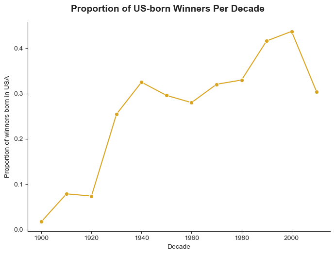

# 📈 Rise of USA Dominance in Nobel Prizes During the 1930s

## Overview

The 1930s marked a pivotal decade in which the United States began to dominate the Nobel Prizes, particularly in science and literature. This shift was not coincidental—it was driven by a combination of geopolitical, cultural, and institutional factors that reshaped the global intellectual landscape.

---

## 🧠 Key Factors Behind the Rise

### 1. Immigration of European Intellectuals

- The **rise of Nazism and Fascism** in Europe forced many prominent scientists, writers, and thinkers—especially **Jewish and anti-fascist** intellectuals—to flee their countries.
- The **United States became a safe haven**, attracting talent from Germany, Austria, Italy, Hungary, and elsewhere.
- **Example:** Albert Einstein emigrated to the US in **1933**, joining the **Institute for Advanced Study** in Princeton.

---

### 2. 🏛️ Growth of American Research Institutions

- The early 20th century saw a **rapid expansion of U.S. universities and research funding**.
- Major institutions such as **MIT, Caltech, Harvard**, and **Stanford** became global leaders.
- **Philanthropic foundations** like the **Rockefeller Foundation** and **Carnegie Institution** funded large-scale scientific and medical research.

---

### 3. 🌍 Decline of European Scientific Centers

- European universities were weakened by:
  - World War I aftermath
  - Fascist regimes and **anti-Semitic policies**
  - Political instability and war-related destruction
- The **brain drain** severely impacted countries like Germany and Austria, with the U.S. reaping the benefits.

---

### 4. 🔬 Evolution of American Scientific Culture

- The U.S. shifted from a largely industrial, engineering-based research model to a **fundamental science-driven** model.
- The **adoption of the European research ethos** helped foster a culture of **original inquiry and innovation**.

---

## 📊 Nobel Prize Trends: 1930s and Beyond
 
- The graph shows a **sharp increase in U.S.-born Nobel winners** starting in the 1930s.
- Although the U.S. had few Nobel laureates in the early 20th century, the **1930s marked a tipping point**.
- By the **1940s and 1950s**, the U.S. had firmly established itself as a **global scientific and intellectual powerhouse**.

---

## 🧾 Conclusion

The 1930s were a watershed moment in Nobel Prize history. The convergence of **geopolitical turmoil in Europe** and **strategic investment in American science and education** created the conditions for a sustained period of U.S. dominance in global intellectual achievements.

---

*Written on 7th August 2025
by Abdelrahman Eslam*